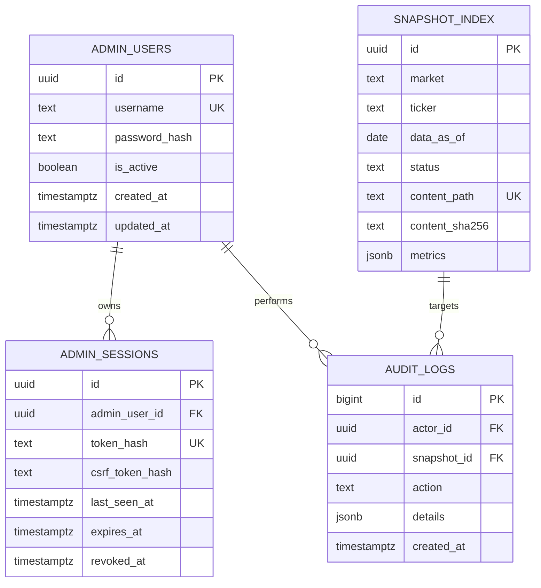

# 企业快照库数据库设计

## 数据库职责

PostgreSQL 保存认证、会话、快照索引和审计日志。Markdown 正文保存在文件系统，数据库不作为内容事实来源。

## 设计原则

- 表结构服务于 MVP，不预建公司百科和行情数据库。
- 快照索引可以从 `content/` 重建。
- 时间统一保存为 `timestamptz`。
- 主键使用 UUID 或有序 UUID。
- 状态变化和文件操作必须留下审计记录。
- 不在数据库保存 Session 原文、密码和 Markdown 正文。

## 表关系



## admin_users

```sql
CREATE TABLE admin_users (
  id uuid PRIMARY KEY,
  username text NOT NULL UNIQUE,
  password_hash text NOT NULL,
  is_active boolean NOT NULL DEFAULT true,
  created_at timestamptz NOT NULL DEFAULT now(),
  updated_at timestamptz NOT NULL DEFAULT now()
);
```

- 用户名标准化为小写后保存。
- 密码使用 Argon2id。
- 首个管理员由 CLI 初始化，不通过公开接口创建。

## admin_sessions

```sql
CREATE TABLE admin_sessions (
  id uuid PRIMARY KEY,
  admin_user_id uuid NOT NULL REFERENCES admin_users(id) ON DELETE CASCADE,
  token_hash text NOT NULL UNIQUE,
  csrf_token_hash text NOT NULL,
  user_agent text,
  ip_prefix inet,
  created_at timestamptz NOT NULL DEFAULT now(),
  last_seen_at timestamptz NOT NULL DEFAULT now(),
  expires_at timestamptz NOT NULL,
  revoked_at timestamptz
);
```

`ip_prefix` 只用于异常排查，可只保留 IPv4 `/24` 或 IPv6 `/56`，并设置日志保留期限。

## snapshot_index

```sql
CREATE TABLE snapshot_index (
  id uuid PRIMARY KEY,
  schema_version integer NOT NULL,
  title text NOT NULL,
  company_name text NOT NULL,
  ticker text NOT NULL,
  market text NOT NULL,
  exchange text NOT NULL,
  reporting_currency text NOT NULL,
  quote_currency text NOT NULL,
  data_as_of date NOT NULL,
  generated_at timestamptz NOT NULL,
  generator text NOT NULL,
  status text NOT NULL,
  verdict text NOT NULL,
  summary text NOT NULL,
  metrics jsonb NOT NULL DEFAULT '{}'::jsonb,
  source_urls jsonb NOT NULL DEFAULT '[]'::jsonb,
  content_path text NOT NULL UNIQUE,
  content_sha256 char(64) NOT NULL,
  validation_errors integer NOT NULL DEFAULT 0,
  validation_warnings integer NOT NULL DEFAULT 0,
  imported_at timestamptz NOT NULL DEFAULT now(),
  published_at timestamptz,
  withdrawn_at timestamptz,
  updated_at timestamptz NOT NULL DEFAULT now(),
  CONSTRAINT snapshot_market_check CHECK (market IN ('CN', 'HK')),
  CONSTRAINT snapshot_exchange_check CHECK (exchange IN ('SSE', 'SZSE', 'HKEX')),
  CONSTRAINT snapshot_status_check CHECK (status IN ('draft', 'published', 'withdrawn')),
  CONSTRAINT snapshot_verdict_check CHECK (verdict IN ('second_round', 'skip')),
  CONSTRAINT snapshot_version_unique UNIQUE (market, ticker, data_as_of)
);
```

### 字段边界

- `content_path` 使用相对 `content/` 根目录的 POSIX 路径。
- `metrics` 只存用于列表和详情头部的快照值。
- `source_urls` 是用于查询和校验的副本。
- 正文 HTML 不持久化；可以按文件哈希放入进程缓存。
- `status` 是数据库工作流状态。Markdown 的 `status` 必须与文件目录匹配，但公开权限仍以数据库事务结果为准；撤回后的数据库状态为 `withdrawn`，草稿文件内写回 `draft`。

## audit_logs

```sql
CREATE TABLE audit_logs (
  id bigint GENERATED ALWAYS AS IDENTITY PRIMARY KEY,
  actor_id uuid REFERENCES admin_users(id) ON DELETE SET NULL,
  snapshot_id uuid REFERENCES snapshot_index(id) ON DELETE SET NULL,
  action text NOT NULL,
  request_id text,
  details jsonb NOT NULL DEFAULT '{}'::jsonb,
  created_at timestamptz NOT NULL DEFAULT now()
);
```

允许的主要 action：

- `login_succeeded`
- `login_failed`
- `snapshot_imported`
- `snapshot_replaced`
- `snapshot_published`
- `snapshot_withdrawn`
- `snapshot_deleted`
- `password_changed`

审计日志只追加，不提供管理端修改接口。

## 索引

```sql
CREATE INDEX snapshot_public_latest_idx
  ON snapshot_index (market, data_as_of DESC, published_at DESC)
  WHERE status = 'published';

CREATE INDEX snapshot_company_versions_idx
  ON snapshot_index (market, ticker, data_as_of DESC)
  WHERE status = 'published';

CREATE INDEX snapshot_status_updated_idx
  ON snapshot_index (status, updated_at DESC);

CREATE INDEX snapshot_company_name_trgm_idx
  ON snapshot_index USING gin (company_name gin_trgm_ops);

CREATE INDEX session_expiry_idx
  ON admin_sessions (expires_at)
  WHERE revoked_at IS NULL;

CREATE INDEX audit_snapshot_time_idx
  ON audit_logs (snapshot_id, created_at DESC);
```

公司名称包含搜索使用 `pg_trgm`。证券代码使用普通 B-tree 精确或前缀查询。首版不建立 Markdown 全文索引。

## 发布事务

```text
BEGIN
→ SELECT snapshot_index ... FOR UPDATE
→ 确认状态、哈希和校验结果
→ 原子移动 drafts 文件到 published
→ UPDATE snapshot_index SET status = published
→ INSERT audit_logs
→ COMMIT
```

数据库回滚不能自动回滚文件系统，因此 service 必须维护补偿动作。进程意外退出时，启动校验任务比较文件目录和索引状态，并把差异报告给管理员，不静默修复已发布内容。

## 索引重建

提供 CLI：

```bash
uv run company-api snapshots rebuild-index --dry-run
uv run company-api snapshots rebuild-index --apply
```

重建顺序：

1. 只读扫描 `drafts` 和 `published`。
2. 解析并校验文件。
3. 比较路径、哈希和数据库记录。
4. 输出新增、变更、缺失和冲突。
5. `--apply` 只写索引，不改 Markdown 文件。

## 迁移

- 使用 Alembic。
- 容器启动时不自动执行破坏性迁移。
- 发布前显式运行 `alembic upgrade head`。
- 每个迁移必须提供回滚说明；无法安全降级时在发布文档注明恢复方式。
- 生产迁移前完成 PostgreSQL 和 content 双份备份。

## 保留策略

- 已撤回快照默认长期保留，便于重新发布和审计。
- 过期 Session 每日清理。
- 审计日志至少保留 365 天。
- 登录失败日志不保存明文密码、完整 Cookie 或完整 IP。
