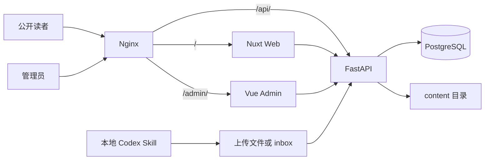

# 企业快照库开发设计

本文是项目设计总入口。开始开发前，先阅读本文，再按任务打开对应专题文档。

## 项目目标

企业快照库用于保存和阅读 A 股、港股公司的财务快照。首版只跑通一条链路：

```text
公司名称或代码
→ Codex 运行 hk-value-snapshot
→ 生成规范 Markdown
→ 管理端导入、校验和预览
→ 人工发布
→ 公开网站阅读
```

网站服务器不运行 Codex、Agent 或 Skill。Skill 与网站只通过 Markdown 文件协作。

## 首版范围

### 包含

- 上海、深圳和香港市场的上市公司。
- 单管理员登录。
- 上传 Markdown 或扫描 `content/inbox/`。
- 草稿校验、预览、发布、撤回和删除。
- 公司快照列表、搜索、市场筛选和详情页。
- Nuxt 服务端渲染和基础 SEO。
- Docker Compose 本地开发及阿里云 ECS 部署。

### 不包含

- 后台自动调用 AI 或抓取公司资料。
- 美股及其他市场。
- 多人协作、公开投稿和用户注册。
- 在线 Markdown 编辑器。
- 图片、PDF、视频和附件托管。
- 盈利预测、目标价和买卖建议。

## 技术栈

| 模块 | 技术 | 职责 |
|---|---|---|
| 公开前台 | Nuxt 4、Vue 3、TypeScript | SSR、搜索、快照阅读、SEO |
| 管理端 | Vue 3、Vite、TypeScript、Pinia | 登录、导入、校验、预览、发布 |
| API | FastAPI、Pydantic、SQLAlchemy、Alembic | 认证、文件事务、索引和公开接口 |
| 数据库 | PostgreSQL | 管理员、会话、快照索引、审计日志 |
| 内容 | YAML frontmatter + GFM Markdown | 快照正文的唯一事实来源 |
| 网关 | Nginx | HTTPS、统一域名、路径路由、压缩和缓存头 |
| 部署 | Docker Compose | 本地及单机生产部署 |

Node.js、Python、PostgreSQL 和 Nginx 使用受支持的稳定主版本，并在工具文件和镜像中锁定。

## 系统架构



只有 FastAPI 可以写入 `content/`。前台和管理端都通过 API 读取数据，避免多个进程同时修改文件。

## 核心数据原则

1. Markdown 是内容事实来源，PostgreSQL 不保存正文。
2. 数据库中的快照记录是可重建索引。
3. Skill 负责市场取数差异，网站只接收统一格式。
4. 导入不等于发布，所有内容必须人工确认。
5. 事实、直接计算和判断在文档中必须分开表达。
6. 同一公司可保存多个数据日期的快照，默认展示最新已发布版本。

Markdown 契约详见 [MARKDOWN_SPEC.md](./MARKDOWN_SPEC.md)。

## 项目目录

```text
company/
├── apps/
│   ├── web/                  # Nuxt 公开前台
│   ├── admin/                # Vue/Vite 管理端
│   └── api/                  # FastAPI
├── content/
│   ├── inbox/
│   ├── drafts/
│   └── published/
│       ├── CN/
│       └── HK/
├── doc/                      # 设计与开发文档
├── infra/nginx/
├── skills/hk-value-snapshot/
├── compose.yaml
├── compose.prod.yaml
└── .env.example
```

## 路由设计

### 公开前台

| 路由 | 页面 | 渲染方式 |
|---|---|---|
| `/` | 最新快照、搜索和市场筛选 | SSR 首屏 + 客户端交互 |
| `/search` | 完整搜索结果 | SSR 首屏 + URL 查询参数 |
| `/snapshots/:market/:ticker` | 公司最新快照 | SSR |
| `/snapshots/:market/:ticker/:date` | 指定日期快照 | SSR |

### 管理端

| 路由 | 页面 |
|---|---|
| `/admin/login` | 管理员登录 |
| `/admin/snapshots` | 草稿和已发布快照列表 |
| `/admin/snapshots/:id` | 校验结果、预览和发布操作 |

### API

所有 API 使用 `/api/v1` 前缀。公开接口与管理员接口在路由和权限上分离。详见 [API_DESIGN.md](./API_DESIGN.md)。

## 页面文档

- [PAGE_MAIN.md](./PAGE_MAIN.md)：首页、快照卡片和视觉系统。
- [PAGE_SEARCH.md](./PAGE_SEARCH.md)：搜索、筛选、排序和结果状态。
- [PAGE_SNAPSHOT.md](./PAGE_SNAPSHOT.md)：公司快照详情页。
- [PAGE_ADMIN.md](./PAGE_ADMIN.md)：登录、管理列表和审核页。

## 后端文档

- [API_DESIGN.md](./API_DESIGN.md)：接口、认证、错误和分页。
- [DATABASE_DESIGN.md](./DATABASE_DESIGN.md)：表结构、索引和事务边界。
- [MARKDOWN_SPEC.md](./MARKDOWN_SPEC.md)：文件路径、frontmatter 和正文契约。

## 部署与搜索引擎

- [DOCKER.md](./DOCKER.md)：本地运行、阿里云 ECS、HTTPS、备份和回滚。
- [SEO.md](./SEO.md)：SSR、canonical、站点地图和结构化数据。

## 开发约定

### 前后端契约

FastAPI 生成 OpenAPI 文档。前端从 OpenAPI 生成 TypeScript 客户端，不重复手写请求和响应类型。

### 文件修改

- 路由层只处理 HTTP 输入和输出。
- 业务规则放在 service。
- Markdown 解析、路径计算和原子写入放在 content 模块。
- 任何模块不得绕过 content service 修改 `content/`。
- 设计或接口发生变化时，先更新 `doc/`，再修改代码。

### 测试层级

| 层级 | 重点 |
|---|---|
| 单元测试 | frontmatter、路径、Markdown 清理、市场代码标准化 |
| API 集成测试 | 登录、导入、发布、撤回、并发和权限 |
| 前端组件测试 | 卡片、筛选、空状态、错误状态和移动布局 |
| 端到端测试 | 上传一份快照并从公开页面读取 |

## 实施顺序

1. 建立 monorepo、容器和开发命令。
2. 落地 Markdown 契约与解析测试。
3. 建立 PostgreSQL 迁移、索引和认证。
4. 完成导入、校验、预览和发布 API。
5. 完成管理端最小闭环。
6. 完成公开首页、搜索和详情页。
7. 增加 SEO、备份、日志和生产部署。
8. 用一份 A 股和一份港股真实快照完成验收。

## 未决事项

- `www.ayaseeri.com` 当前已有网站。正式部署前要决定替换现站，还是先用独立子域名验证。
- `hk-value-snapshot` 名称保留还是改成市场中立名称，不影响首版接口。
- 首页产品名“企业快照库”为暂定名称。
