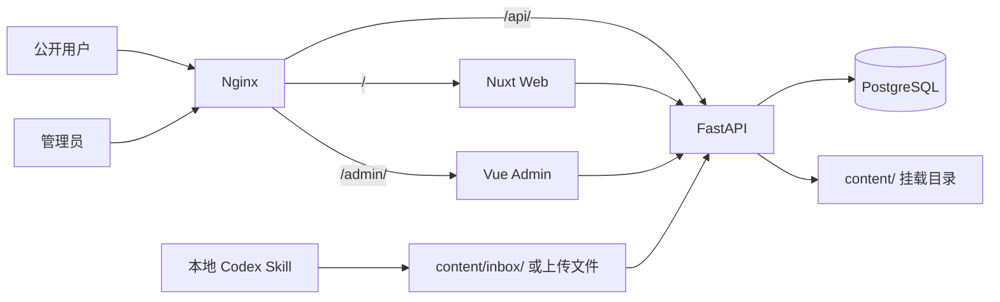

# A 股与港股企业快照网站设计

日期：2026-07-16

## 1. 目标

建立一个移动优先的公司财务快照网站，跑通以下最小闭环：

1. 用户在 Codex 中输入 A 股或港股公司名称、代码。
2. 本地 `hk-value-snapshot` Skill 获取公开财报和行情数据，生成企业快照 Markdown。
3. 管理员将 Markdown 上传管理端，或把文件放进 `content/inbox/`。
4. FastAPI 校验文件，管理端预览并确认发布。
5. Nuxt 前台展示已发布的公司快照。

网站不在服务器内运行 Codex、AI Agent 或 Skill。Skill 与网站以 Markdown 文件为唯一交付契约。

## 2. 首版范围

### 2.1 支持

- A 股：上海证券交易所、深圳证券交易所。
- 港股：香港交易所。
- 单管理员登录。
- Markdown 上传和 `content/inbox/` 目录扫描。
- Markdown 元数据及正文结构校验。
- 草稿预览、发布、撤回、删除草稿。
- 公开公司快照列表。
- 按公司名称、证券代码和市场搜索或筛选。
- 快照 Markdown 安全渲染。
- Docker Compose 一键启动全部网站服务。

### 2.2 不支持

- 网站后台调用 AI 或 Skill。
- 网站自动抓取财报、行情或公司资料。
- 美股和其他市场。
- 产品、用户、行业、管理层和企业文化专题。
- 用户注册、投稿和多人协作。
- 图片、视频、PDF 和文档托管。
- 长期盈利预测、目标价和买卖建议。
- Skill 生成的 HTML 文件导入和展示。

## 3. 核心设计原则

1. **Markdown 是内容事实来源。** PostgreSQL 不保存 Markdown 正文。
2. **Skill 和网站解耦。** Skill 只需遵守 Markdown 契约，网站不依赖其内部取数实现。
3. **市场差异留在 Skill 内。** A 股与港股使用不同数据适配器，但输出相同结构。
4. **只发布实际数据和直接运算。** 保留现有 Skill 的“不预测、不估算、不评级”边界。
5. **发布必须人工确认。** 导入成功不等于公开发布。
6. **移动优先。** 手机端完成查找和阅读，管理端在手机可用、桌面效率更高。

## 4. 系统架构

项目使用单仓库管理三个独立应用：

```text
apps/
├── web/                  # Nuxt + TypeScript，公开前台
├── admin/                # Vue 3 + Vite + TypeScript，管理端
└── api/                  # FastAPI + Python，后台 API
content/
├── inbox/                # Skill 或人工放入的待导入 Markdown
├── drafts/               # 校验通过但未发布的 Markdown
└── published/
    ├── CN/               # A 股已发布快照
    └── HK/               # 港股已发布快照
skills/
└── hk-value-snapshot/    # 现有快照 Skill，需统一 A/H 输出契约
infra/
└── nginx/                # Nginx 反向代理配置
docs/
compose.yaml
compose.prod.yaml
.env.example
```

运行服务：

- `web`：Nuxt 服务端渲染公开页面。
- `admin`：Vue/Vite 构建的管理端 SPA。
- `api`：登录、导入、校验、索引、发布和公开 API。
- `postgres`：管理员、快照索引和操作日志。
- `nginx`：统一域名、静态资源、HTTPS 和路径路由。

不引入 Redis、任务 Worker、MinIO 或消息队列。

### 4.1 技术栈

| 层 | 技术 | 具体职责 |
|---|---|---|
| 公开前台 | Nuxt 4、Vue 3、TypeScript | SSR 页面、SEO、搜索和 Markdown 快照阅读 |
| 管理端 | Vue 3、Vite、TypeScript、Vue Router、Pinia | 登录、上传、校验结果、预览和发布操作 |
| API | FastAPI、Pydantic、SQLAlchemy、Alembic | 认证、文件校验、内容索引、Markdown 渲染和发布事务 |
| 数据库 | PostgreSQL | 管理员、会话、可重建快照索引和审计日志 |
| 内容 | YAML frontmatter + GFM Markdown | 快照正文的唯一事实来源 |
| 反向代理 | Nginx | 统一入口、路径路由、压缩、缓存头和生产 TLS |
| 工程工具 | pnpm workspace、Python uv、OpenAPI | 前端依赖、Python 依赖和类型化 API 客户端 |

Node.js、Python、PostgreSQL 和 Nginx 均使用受支持的稳定版本，并在项目工具文件及 Docker 镜像中固定主版本。规格不绑定具体补丁版本。

### 4.2 应用模块边界

`apps/web`：

```text
app/
├── pages/
│   ├── index.vue
│   └── snapshots/[market]/[ticker]/[[date]].vue
├── components/
│   ├── AppHeader.vue
│   ├── CompanySearch.vue
│   ├── MarketFilter.vue
│   ├── SnapshotCard.vue
│   ├── SnapshotHeader.vue
│   ├── MetricStrip.vue
│   ├── VerdictBanner.vue
│   ├── SnapshotBody.vue
│   └── SnapshotToc.vue
├── composables/useSnapshots.ts
└── assets/css/
```

公开前台不直接读取磁盘或数据库，只调用公开 API。列表页使用 Nuxt SSR 获取首屏数据；搜索和筛选在客户端更新 URL 查询参数并重新请求。

`apps/admin`：

```text
src/
├── views/
│   ├── LoginView.vue
│   ├── SnapshotListView.vue
│   └── SnapshotReviewView.vue
├── components/
│   ├── AdminShell.vue
│   ├── SnapshotTable.vue
│   ├── UploadPanel.vue
│   ├── ValidationReport.vue
│   ├── MetadataPanel.vue
│   └── MarkdownPreview.vue
├── stores/auth.ts
├── router/index.ts
└── api/generated/
```

管理端使用 OpenAPI 生成的 TypeScript 类型和请求客户端，不手写重复接口类型。Pinia 只保存登录状态和界面状态；服务端数据不长期复制进全局 Store。

`apps/api`：

```text
app/
├── main.py
├── core/                 # 配置、安全、数据库和日志
├── auth/                 # 登录、会话和 CSRF
├── snapshots/            # 路由、schema、服务和索引
├── content/              # frontmatter、Markdown、文件事务
├── audit/                # 操作日志
└── health/               # 存活和就绪检查
```

路由层只处理 HTTP；业务规则放在 service；文件解析、路径计算和原子写入放在 content 模块。任何模块都不能绕过 content service 直接修改 `content/`。

### 4.3 运行拓扑



只有 FastAPI 容器以读写方式挂载 `content/`。Nuxt 和管理端通过 API 获取内容，避免多个进程同时写文件。

生产环境运行在一台阿里云 ECS 上。ECS 安全组是公网入口，Docker Compose 内部网络承载应用通信；PostgreSQL、Nuxt、管理端和 FastAPI 均不直接暴露公网端口。

### 4.4 请求与发布链路

公开读取：

```text
浏览器 → Nginx → Nuxt SSR → FastAPI public API
       ← 已渲染首屏 ← 元数据 + 安全 HTML
```

导入发布：

```text
上传/扫描 inbox
→ FastAPI 读取临时文件
→ Pydantic 校验 frontmatter
→ Markdown 结构和安全校验
→ 原子写入 drafts
→ PostgreSQL 更新索引
→ 管理端预览
→ 发布事务移动到 published
→ 更新索引和审计日志
```

Markdown 使用服务端解析。解析器关闭原始 HTML，启用 GFM 表格、列表、引用和代码；渲染结果再经过 HTML 白名单清理。公开 API 返回安全 HTML，管理端预览与公开页面使用同一结果，避免两套渲染规则不一致。

## 5. Markdown 内容契约

### 5.1 文件路径

草稿文件：

```text
content/drafts/{market}/{ticker}/{data_as_of}.md
```

发布文件：

```text
content/published/{market}/{ticker}/{data_as_of}.md
```

示例：

```text
content/published/CN/600519/2026-07-16.md
content/published/HK/00700/2026-07-16.md
```

同一公司同一数据日期只允许存在一份已发布快照。重新导入时必须选择覆盖草稿或保留原文件，不能静默覆盖已发布文件。

### 5.2 必填 frontmatter

```yaml
---
schema_version: 1
type: value_snapshot
title: 价值线企业快照版 — 腾讯控股
company_name: 腾讯控股
ticker: "00700"
market: HK
exchange: HKEX
reporting_currency: CNY
quote_currency: HKD
data_as_of: 2026-07-16
generated_at: 2026-07-16T10:30:00+08:00
generator: hk-value-snapshot
status: draft
verdict: second_round
summary: 入口未到历史低位，现金流质量稳定，需继续核查资本配置。
metrics:
  price: 512.50
  pe_ttm: 21.4
  pb: 3.8
  dividend_yield_pct: 0.82
  market_cap_million: 48120.00
source_urls:
  - https://example.com/financial-source
  - https://example.com/quote-source
---
```

字段约束：

- `schema_version` 首版固定为 `1`。
- `type` 固定为 `value_snapshot`。
- `ticker` 必须是字符串，保留前导零。
- `market` 只能是 `CN` 或 `HK`。
- `exchange` 只能是 `SSE`、`SZSE` 或 `HKEX`。
- `CN` 对应 `SSE` 或 `SZSE`；`HK` 对应 `HKEX`。
- `data_as_of` 是行情和快照对应的数据日期，不是上传日期。
- `status` 只能是 `draft` 或 `published`。
- `verdict` 只能是 `second_round` 或 `skip`，分别对应“进入第二轮”和“翻页”。
- `summary` 是首页使用的一句话结论，最多 120 个中文字符。
- `metrics` 保存详情页顶部使用的结构化快照值：`price` 为每股报价，`pe_ttm` 和 `pb` 为倍数，`dividend_yield_pct` 为百分数，`market_cap_million` 为报价币种的百万单位；缺失指标写 `null`，禁止从 Markdown 表格反向解析。
- `source_urls` 至少包含一个有效的 HTTP 或 HTTPS 地址。
- 发布时 API 将 `status` 改为 `published`，并原子移动到 `content/published/`。
- 发布时 API 增加 `published_at`；撤回时移除该字段。

### 5.3 正文结构

Skill 继续使用固定模块顺序：

1. 标题与数据日期。
2. 价格、PE、PB、股息率和市值。
3. 30 秒结论。
4. 公司业务与商业模式。
5. 企业快照上半部。
6. 企业快照下半部。
7. 5 秒心算。
8. 资本结构与流动性。
9. 年均变化率。
10. 五问检查清单。
11. 数据来源、口径注释和免责声明。

网站不从正文重新推断证券代码、市场或数据日期；这些信息必须来自 frontmatter。

### 5.4 A 股与港股适配

现有 Skill 的说明、模板和校验主要按港股编写，但数据接口参考已经列出 A 股接口。正式接入前必须统一：

- Skill 描述同时触发 A 股和港股请求。
- 根据代码或明确市场选择 `CN` 或 `HK` 数据适配器。
- A 股区分 `SSE` 与 `SZSE`。
- 港股继续处理财报币种与港元行情的折算。
- A 股使用人民币报价，不套用港股汇率、股息和历史股本规则。
- 模板中的 `.HK`、`HK$`、港元市值等固定文字改为变量。
- 两个适配器最终生成完全相同的 frontmatter 和正文模块。
- Skill 增加可选输出目录参数；在本项目中指定为 `content/inbox/`，未指定时仍输出到项目根目录。

Skill 可以暂时保留 `hk-value-snapshot` 名称，但其 description 必须明确包含 A 股触发条件，避免 A 股请求无法触发。

## 6. 用户流程

### 6.1 生成

1. 用户在 Codex 中请求为一家公司生成企业快照。
2. Skill 识别市场和证券代码；无法唯一识别时要求用户确认。
3. Skill 获取并核验数据，生成 Markdown 和 HTML。
4. 网站只使用 Markdown；HTML 留作独立交付文件。

### 6.2 导入

支持两种方式：

- 在管理端选择一个 `.md` 文件上传。
- 把 `.md` 文件放入 `content/inbox/`，然后在管理端点击“扫描待导入文件”。

API 按以下顺序处理：

1. 检查扩展名、UTF-8 编码和文件大小。
2. 解析 YAML frontmatter。
3. 校验字段、市场和正文必需章节。
4. 检查目标公司、日期是否重复。
5. 将通过校验的文件原子写入 `content/drafts/`。
6. 更新 PostgreSQL 快照索引。
7. 返回预览地址和警告信息。

任何一步失败都不得产生半写入文件。

### 6.3 发布

1. 管理员打开草稿预览。
2. 页面同时显示公司、代码、市场、数据日期和来源链接。
3. 管理员确认发布。
4. API 更新 frontmatter 状态并原子移动文件。
5. API 更新索引并写入操作日志。
6. 公开 API 立即可读取新快照。

撤回发布会把文件移回草稿目录并保留内容。首版不提供已发布文件的物理删除；只能撤回后再删除草稿。

## 7. 页面设计

产品暂定名为“企业快照库”。视觉目标是“研究台账”，不是资讯门户或行情终端：信息密度高，但通过稳定的数字对齐、分隔线和留白保持可读性。

### 7.0 视觉语言

颜色变量：

| Token | 色值 | 用途 |
|---|---|---|
| `--canvas` | `#F2F5F6` | 页面背景 |
| `--surface` | `#FFFFFF` | 卡片、表格和正文 |
| `--ink` | `#17212B` | 主文字 |
| `--muted` | `#66727D` | 次要说明 |
| `--line` | `#D7DEE3` | 分隔线和边框 |
| `--accent` | `#155E75` | 主操作、链接和选中状态 |
| `--positive` | `#2F6B4F` | 进入第二轮、通过 |
| `--caution` | `#A15C16` | 警告和待核查 |
| `--negative` | `#A33A3A` | 翻页、失败和高风险错误 |

字体：

- 正文和界面：系统无衬线中文字体栈，保证跨平台加载稳定。
- 财务数字：`font-variant-numeric: tabular-nums`，保证列对齐。
- 代码、证券代码和数据日期：系统等宽字体。
- 不依赖运行时外部字体服务。

形态：

- 卡片圆角 8px，按钮圆角 6px，不使用大面积胶囊形控件。
- 阴影只用于浮层；普通卡片使用 1px 边框。
- 8px 间距基线；内容最大宽度 1180px；正文阅读列最大宽度 820px。
- 标志性元素是“快照扫描轨”：详情页用一条五段式细轨显示五步扫描结果，桌面竖排、手机横向滚动。
- 动画只用于 150–200ms 的状态切换和浮层，不做滚动入场动画。

### 7.0.1 响应式规则

- 手机：`0–767px`，单列，页面左右边距 16px，点击目标至少 44px。
- 平板：`768–1199px`，列表两列，详情正文单列，目录折叠。
- 桌面：`1200px+`，列表三列或紧凑表格，详情为正文加右侧目录。
- 财务表格在窄屏使用独立横向滚动容器，首列保持粘性；不把表格缩成不可读的小字。

### 7.1 公开首页

页面从上到下：

1. 56px 高度页头：左侧“企业快照库”，右侧“关于数据”链接。
2. 搜索区：标题“从事实开始看一家公司”，下方是公司名称/代码搜索框。
3. 筛选行：全部、A 股、港股；右侧显示结果数量。
4. 最近更新列表：默认按数据日期倒序。
5. 页脚：数据边界、免责声明和最后构建时间。

手机线框：

```text
┌────────────────────────┐
│ 企业快照库       关于数据 │
├────────────────────────┤
│ 从事实开始看一家公司       │
│ [ 搜索名称或证券代码     ] │
│ [全部] [A股] [港股]  12家 │
├────────────────────────┤
│ 腾讯控股        00700 HK │
│ 数据日期 2026-07-16      │
│ 【进入第二轮】            │
│ 现金流稳定，需核查资本配置  │
├────────────────────────┤
│ 贵州茅台       600519 CN │
│ 数据日期 2026-07-16      │
└────────────────────────┘
```

桌面卡片每行三张。卡片固定显示公司名称、代码、市场、数据日期、`verdict` 印章和两行 `summary`；不在首页堆放 PE、PB 等全部指标。点击整张卡片进入详情，证券代码保持可选中文本。

搜索输入防抖 250ms，并把 `q`、`market` 写入 URL。无结果时显示当前条件并提供“清除筛选”，不显示空白页面。

### 7.2 快照详情

桌面使用 12 列网格：正文占 9 列，右侧目录占 3 列；手机为单列。

```text
┌─────────────────────────────────────────────┐
│ ← 返回公司列表                              │
│ 腾讯控股  00700 · HKEX       [2026-07-16 ▼]│
│ 实际披露数据与直接运算 · 不构成投资建议       │
├───────────────────────────────┬─────────────┤
│ 价格  PE  PB  股息率  市值     │ 快照扫描轨   │
│ 【进入第二轮】一句话结论         │ ①长期记录 ✓ │
│                               │ ②ROE杠杆 △ │
│ Markdown 正文                 │ ③股本变化 ✓ │
│ 财务表格                       │ ④利润率  ✓ │
│ 五问清单                       │ ⑤估值锚  △ │
│                               │ 页面目录     │
└───────────────────────────────┴─────────────┘
```

- 顶部元数据区显示公司、代码、交易所、数据日期和日期切换。
- 关键指标条读取 frontmatter 的 `metrics`；缺失的单项直接隐藏，不解析正文表格。
- `verdict` 使用低饱和实色印章，不使用闪烁或渐变。
- 右侧目录随滚动高亮当前章节；手机端变为标题下方的“本页目录”折叠面板。
- 正文保留 Markdown 标题层级；H2 之间至少 48px 间距。
- 来源链接集中显示在页尾，同时保留正文中的上下文链接。
- 多期快照通过日期下拉切换，不做趋势图和自动差异比较。

### 7.3 后台登录

- 页面为单列登录面板，桌面宽 400px，手机占满可用宽度。
- 字段只有用户名、密码和“登录”按钮。
- 密码支持显隐切换；按 Enter 提交。
- 提交中禁用按钮并显示进度文字“正在登录”。
- 登录失败在表单顶部显示统一错误“用户名或密码不正确”。
- 不提供注册、找回密码、第三方登录或宣传内容。

### 7.4 快照管理

桌面采用 220px 左侧导航和主内容区；手机导航折叠为顶部菜单。左侧只有“快照”和“退出登录”，不预留空模块。

列表工具栏：

- 页面标题和草稿/已发布数量。
- “上传 Markdown”主按钮。
- “扫描 inbox”次按钮。
- 搜索、市场筛选、状态筛选。

桌面列表采用表格，列为公司、代码、市场、数据日期、状态、导入时间和操作。手机改为卡片，不使用横向滚动的管理表格。

审核页采用明确的三段结构：

```text
┌─────────────────────────────────────────────┐
│ ← 返回快照    腾讯控股 00700     [发布]      │
├───────────────┬─────────────────────────────┤
│ 元数据         │ Markdown 最终预览            │
│ ✓ schema       │                             │
│ ✓ 市场/代码     │ 与公开页面相同的渲染结果       │
│ △ 1 条警告      │                             │
│ 来源链接        │                             │
├───────────────┴─────────────────────────────┤
│ 错误必须修复；警告确认后才可发布               │
└─────────────────────────────────────────────┘
```

- 错误使用红色并阻止发布；警告使用琥珀色，可确认后发布。
- 上传文件先在浏览器显示文件名和大小，再提交 API；不提供在线 Markdown 编辑器。
- 发布前使用确认对话框，明确公司、市场和数据日期。
- 撤回不会删除文件；删除只对草稿开放，并要求二次确认。
- 管理端右上角账号菜单提供“修改密码”和“退出登录”；不增加独立设置模块。

### 7.5 通用状态与可访问性

- 加载使用与最终布局一致的骨架屏，避免页面跳动。
- API 错误显示可执行的信息，例如“文件缺少 `data_as_of`”，不使用“发生错误”。
- 所有交互元素有可见键盘焦点。
- 颜色不作为唯一状态表达，印章同时包含文字和符号。
- 正文与背景对比度符合 WCAG AA。
- 遵守 `prefers-reduced-motion`。
- 空状态提供下一步操作：公开端清除筛选，管理端上传 Markdown。

## 8. API 边界

FastAPI 统一使用 `/api` 前缀和 JSON 响应。成功响应返回资源本身；错误响应固定为：

```json
{
  "error": {
    "code": "SNAPSHOT_VALIDATION_FAILED",
    "message": "Markdown 校验失败",
    "details": [
      {"field": "data_as_of", "message": "缺少必填字段"}
    ]
  }
}
```

公开列表使用游标分页，首版默认 24 条；查询参数为 `q`、`market`、`cursor`。管理列表额外支持 `status`。

### 8.1 认证

```text
POST /api/auth/login
POST /api/auth/logout
POST /api/auth/change-password
GET  /api/auth/me
```

### 8.2 管理端

```text
GET    /api/admin/snapshots
POST   /api/admin/snapshots/import
POST   /api/admin/snapshots/scan-inbox
GET    /api/admin/snapshots/{id}
GET    /api/admin/snapshots/{id}/preview
POST   /api/admin/snapshots/{id}/publish
POST   /api/admin/snapshots/{id}/unpublish
DELETE /api/admin/snapshots/{id}
```

### 8.3 公开端

```text
GET /api/public/snapshots
GET /api/public/snapshots/{market}/{ticker}
GET /api/public/snapshots/{market}/{ticker}/{data_as_of}
```

公开列表只返回元数据和摘要，不返回正文。详情接口返回解析后的元数据与经过白名单清理的 `content_html`；原始 Markdown 只通过已认证的管理详情接口返回。

## 9. 数据库

首版仅包含四类表：

- `admin_users`：管理员用户名、密码哈希、创建时间和状态。
- `admin_sessions`：随机会话令牌哈希、CSRF 令牌哈希、过期时间和最后使用时间。
- `snapshot_index`：文件路径、公司、代码、市场、数据日期、状态、标题、摘要和更新时间。
- `audit_logs`：导入、发布、撤回和删除草稿记录。

`snapshot_index` 是派生索引，必须能通过扫描 `content/drafts/` 和 `content/published/` 完整重建。

首个管理员不通过公开接口创建。API 第一次启动时读取环境变量 `ADMIN_USERNAME` 和 `ADMIN_PASSWORD`：数据库尚无管理员时创建账号，已经存在时忽略这两个值。部署完成后应从环境配置中移除明文初始密码，并通过受保护的管理接口修改密码。

关键约束：

- `snapshot_index` 唯一键为 `(market, ticker, data_as_of)`。
- `ticker` 使用字符串类型。
- `file_path` 必须是相对 `content/` 的规范化路径且唯一。
- 删除或撤回文件和更新索引必须在 service 中作为一个应用事务执行；数据库失败时回滚文件移动。
- `audit_logs` 只追加，不提供修改接口。

## 10. 安全与错误处理

- 密码使用 Argon2id 哈希。
- 登录使用 HttpOnly、Secure、SameSite Cookie。
- 所有修改请求验证 CSRF Token。
- 上传只接受 UTF-8 `.md`，首版最大 2 MB。
- 拒绝路径穿越、符号链接和包含空字节的文件名。
- Markdown 禁止原始 HTML，使用标签白名单渲染，阻止 XSS。
- 外部链接添加 `rel="noopener noreferrer"`。
- YAML 解析使用安全模式，不实例化任意对象。
- 写文件采用同目录临时文件加原子重命名。
- 无效文件保留在 `content/inbox/`，后台显示错误，不自动删除。
- 数据库与内容索引不一致时，以磁盘 Markdown 为准并重建索引。

## 11. Docker 部署

首版生产环境部署到阿里云 ECS，不使用 Cloudflare Workers、Pages、D1 或 R2。Docker Compose 同时作为本地和生产编排方式，差异通过环境变量和生产覆盖文件表达。

`compose.yaml` 包含：

- `nginx`
- `web`
- `admin`
- `api`
- `postgres`

容器职责：

- `nginx`：基于稳定版 Nginx 镜像，挂载只读配置；对静态资源设置长缓存，对 HTML 和 API 禁止错误缓存。
- `web`：Nuxt 多阶段构建后的 Node 服务，只运行生产输出。
- `admin`：Vite 多阶段构建，最终使用轻量 Nginx 容器提供静态文件和 SPA fallback。
- `api`：Python slim 多阶段镜像，以非 root 用户运行 Uvicorn；启动前执行 Alembic migration。
- `postgres`：命名卷持久化，数据库只暴露给 Compose 内部网络。

所有应用容器设置 CPU/内存友好的默认值、日志轮转和 `restart: unless-stopped`。只有顶层 Nginx 暴露宿主机端口。

持久化：

- PostgreSQL 使用命名卷。
- `content/` 使用宿主机绑定挂载，便于备份和 Git 管理。
- 代码打包进镜像，不在运行时修改。

网站不自动执行 Git commit 或 push。管理员完成发布后，可在宿主机检查 `content/` 变化并人工提交；远程仓库凭证不进入应用容器。

健康检查：

- API 提供 `/api/health/live` 和 `/api/health/ready`。
- PostgreSQL 使用 `pg_isready`。
- Nginx 只在上游服务健康后转发请求。

路由：

- `/api/*` → FastAPI
- `/admin/*` → Vue Admin
- 其他路径 → Nuxt Web

本地 Docker 环境默认使用 HTTP。生产环境由 Nginx 加载宿主机挂载的 TLS 证书；证书申请与自动续期不纳入首版应用代码。

### 11.1 阿里云 ECS 基线

首版建议配置：

- 2 核 CPU、4 GB 内存。
- 40–80 GB 系统盘或数据盘。
- Ubuntu LTS 或 Alibaba Cloud Linux 的受支持版本。
- 固定公网 IP 或 EIP。
- 服务器时区设置为 `Asia/Shanghai`，容器内部日志统一使用 UTC 并携带时区信息。

这是低流量个人研究站的起步配置，不是硬编码的运行要求。持续监测内存、磁盘和数据库大小后再升级。

### 11.2 ECS 安全组

入方向只开放：

| 端口 | 来源 | 用途 |
|---|---|---|
| 80/TCP | `0.0.0.0/0`、`::/0` | HTTP，仅用于跳转 HTTPS 和证书验证 |
| 443/TCP | `0.0.0.0/0`、`::/0` | HTTPS 网站 |
| 22/TCP | 管理员固定 IP | SSH 运维 |

PostgreSQL `5432`、FastAPI `8000`、Nuxt `3000` 不加入安全组公网规则，也不在 Compose 中映射到宿主机。只有 Nginx 暴露 `80` 和 `443`。

生产服务器禁用 root 密码登录，使用 SSH 密钥；SSH 管理 IP 变化时先更新安全组，避免临时放开到全网。

### 11.3 服务器目录

```text
/srv/company/
├── app/                         # Git 代码仓库
├── data/
│   └── content/                 # inbox、drafts、published Markdown
├── backups/
│   ├── postgres/
│   └── content/
├── logs/
│   └── nginx/
└── secrets/
    └── .env                     # 600 权限，不进入 Git
```

生产 Compose 将 `/srv/company/data/content` 挂载为 FastAPI 容器的 `/data/content`。本地开发继续挂载仓库内的 `content/`。

本地 Codex 生成的 Markdown 主要通过管理端上传进入服务器。只有在 Codex 直接运行于服务器仓库时，才允许输出到 `/srv/company/data/content/inbox/`；不要求为了导入一份快照执行完整代码部署。

### 11.4 Docker 网络

Compose 定义两个网络：

- `edge`：Nginx、Nuxt、管理端。
- `backend`：Nginx、Nuxt、FastAPI、PostgreSQL；设置为 internal。

PostgreSQL 只加入 `backend`。Nginx 同时加入 `edge` 和 `backend`。服务之间使用 Compose 服务名解析，不写固定容器 IP。

### 11.5 Nginx 生产配置

- HTTP 全部 301 跳转 HTTPS，证书验证路径除外。
- `/api/` 代理 FastAPI。
- `/admin/` 代理管理端静态服务。
- `/` 代理 Nuxt。
- 上传限制与应用一致，设置为 2 MB。
- 登录接口设置基础速率限制。
- 代理传递真实 IP、协议和 Host。
- 静态资源使用带内容哈希的长缓存；HTML、管理端入口和 API 不使用长期缓存。
- 设置 HSTS、`X-Content-Type-Options`、`Referrer-Policy` 和适合当前页面的 Content Security Policy。

### 11.6 HTTPS 与域名

1. 域名 A 记录指向 ECS 公网 IP。
2. Nginx 先以 HTTP 配置启动。
3. 使用 Certbot 或阿里云 SSL 证书签发证书。
4. 证书目录以只读方式挂载进 Nginx 容器。
5. 自动续期在宿主机执行；续期成功后运行 `docker compose exec nginx nginx -s reload`。

如果 ECS 位于中国内地，必须在公开使用域名前完成相应 ICP 备案，并在网站页脚展示备案信息。中国香港或海外节点不要求 ICP 备案。

### 11.7 环境配置

`.env.example` 至少包含：

```text
APP_ENV=development
APP_BASE_URL=http://localhost
POSTGRES_DB=company
POSTGRES_USER=company
POSTGRES_PASSWORD=change-me
ADMIN_USERNAME=admin
ADMIN_PASSWORD=change-me
SESSION_SECRET=change-me
CONTENT_ROOT=/data/content
```

真实 `.env` 不进入 Git。生产环境必须替换所有 `change-me` 值。

### 11.8 启动依赖

1. PostgreSQL 健康。
2. API 执行迁移、创建首个管理员、扫描内容索引并就绪。
3. Nuxt 和管理端启动。
4. Nginx 开始对外提供服务。

API 就绪检查同时验证数据库连接和 `content/` 目录可读写；任一失败时返回非 200 状态。

### 11.9 首次部署

```text
1. 创建 ECS、固定公网 IP 和安全组
2. 安装 Git、Docker Engine 和 Docker Compose Plugin
3. 克隆仓库到 /srv/company/app
4. 创建 data、backups、logs、secrets 目录并设置权限
5. 从 .env.example 创建 /srv/company/secrets/.env
6. docker compose -f compose.yaml -f compose.prod.yaml build
7. docker compose -f compose.yaml -f compose.prod.yaml up -d postgres api web admin nginx
8. docker compose -f compose.yaml -f compose.prod.yaml ps 并检查全部健康状态
9. 配置域名和 HTTPS
10. 导入 A 股、港股各一份快照做验收
```

### 11.10 日常发布与回滚

日常发布：

```bash
cd /srv/company/app
git pull --ff-only
docker compose -f compose.yaml -f compose.prod.yaml build
docker compose -f compose.yaml -f compose.prod.yaml up -d
docker compose -f compose.yaml -f compose.prod.yaml ps
```

数据库 migration 必须向后兼容当前与上一个应用版本。部署失败时检出上一个 Git 标签并重新构建；如果 migration 不兼容，则先从部署前备份恢复数据库，再恢复应用。

不在服务器直接修改应用代码。`content/` 是运行数据，可由管理端写入，不随应用镜像回滚。

### 11.11 备份与恢复

- PostgreSQL：每日执行 `pg_dump -Fc`，保留 7 份日备份和 4 份周备份。
- Markdown：每日归档 `/srv/company/data/content`；该目录可初始化为独立私有 Git 仓库，由管理员人工提交作为额外历史。
- 备份至少复制一份到 ECS 之外，可使用阿里云 OSS 或另一台设备。
- ECS 云盘快照是补充手段，不能代替数据库逻辑备份。
- 每月执行一次恢复演练：把最新数据库和 Markdown 备份恢复到临时目录，启动隔离 Compose 项目并打开一份快照。

### 11.12 日志与运维

- Docker 日志使用 `json-file` 轮转，限制单文件大小和保留数量。
- Nginx 访问日志与错误日志写入 `/srv/company/logs/nginx/` 并轮转。
- FastAPI 日志包含请求 ID、状态码、耗时和管理员操作类型，不记录密码、Cookie 或 Markdown 正文。
- 监控至少覆盖容器健康、磁盘使用率、数据库备份结果和 TLS 证书到期时间。
- 磁盘使用率达到 80% 时必须告警；备份连续两次失败时必须告警。

## 12. 测试与验收

### 12.1 单元测试

- A 股和港股 frontmatter 校验。
- 证券代码前导零保留。
- 市场与交易所组合校验。
- 必需章节检查。
- Markdown HTML/XSS 清理。
- 文件目标路径计算。
- 重复快照处理。

### 12.2 API 集成测试

- 登录成功、失败和退出。
- 未认证用户不能访问管理接口。
- 上传有效 A 股和港股 Markdown。
- 上传无效 YAML、错误市场、超大文件和危险文件名。
- 导入、预览、发布、撤回和删除草稿完整流程。
- 索引清空后可以从 Markdown 重建。

### 12.3 前端测试

- 首页搜索和市场筛选。
- Markdown 表格在手机端可横向滚动。
- 详情页正确显示元数据、来源和免责声明。
- 后台显示校验错误并阻止发布。

### 12.4 端到端验收

使用一份 A 股和一份港股样例完成：

1. Docker Compose 启动成功。
2. 管理员登录。
3. 导入两个 Markdown。
4. 预览内容和表格。
5. 发布。
6. 前台按市场和代码找到两家公司。
7. 打开详情并验证数据日期、来源和正文。
8. 撤回其中一份，前台立即不可见。

## 13. 实施顺序

1. 统一 Skill 的 A 股/港股 Markdown 契约，并生成两份固定测试样例。
2. 建立 Monorepo、Docker Compose 和服务健康检查。
3. 实现 FastAPI 文件导入、校验、索引和认证。
4. 实现管理端导入、预览与发布。
5. 实现 Nuxt 首页和快照详情。
6. 完成端到端测试和 Docker 部署验证。

这一顺序先固定输入契约，再实现消费者，避免网站围绕不稳定模板返工。
